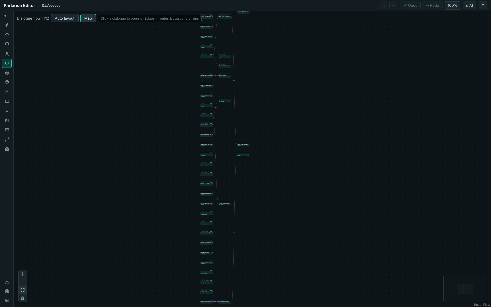
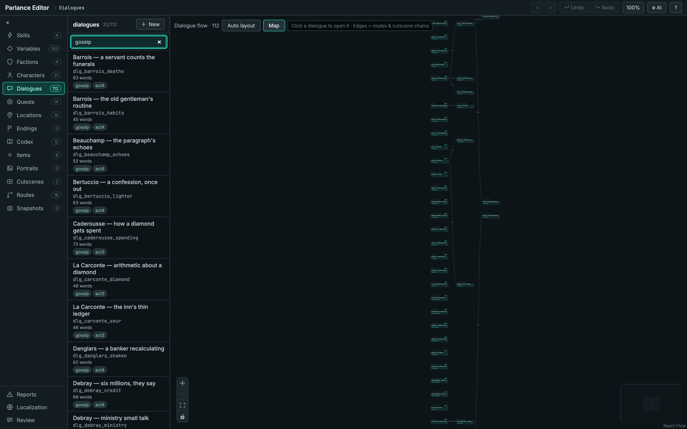
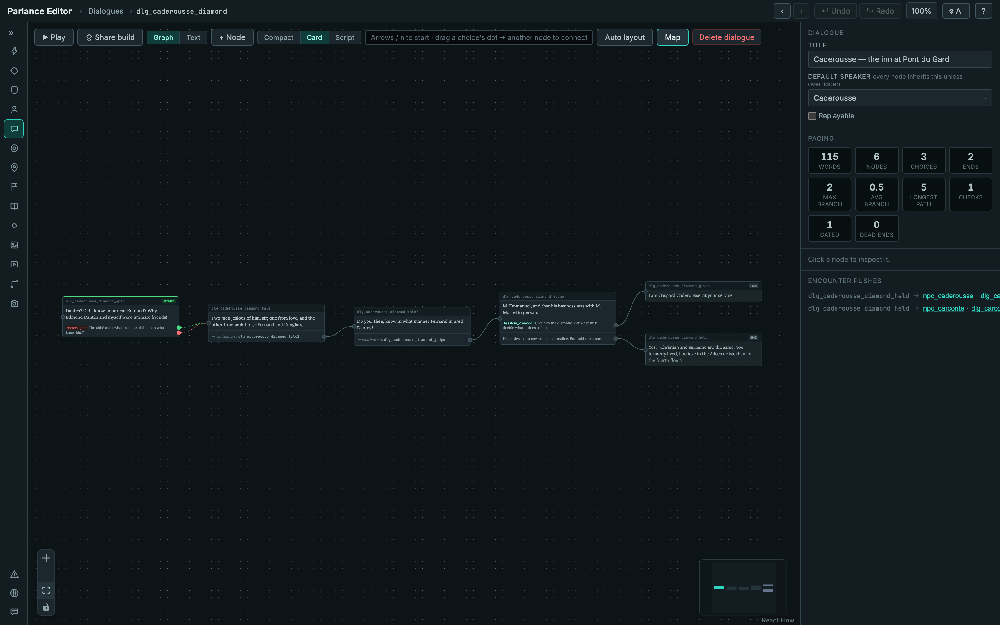
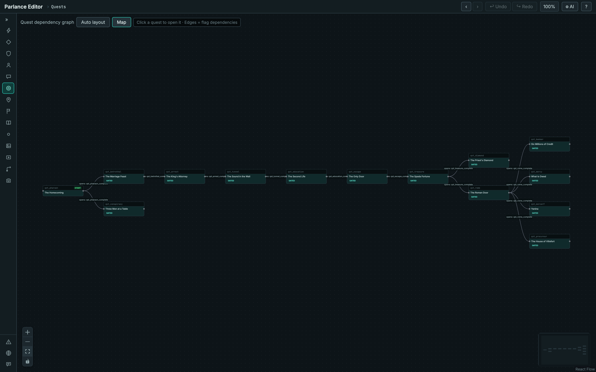
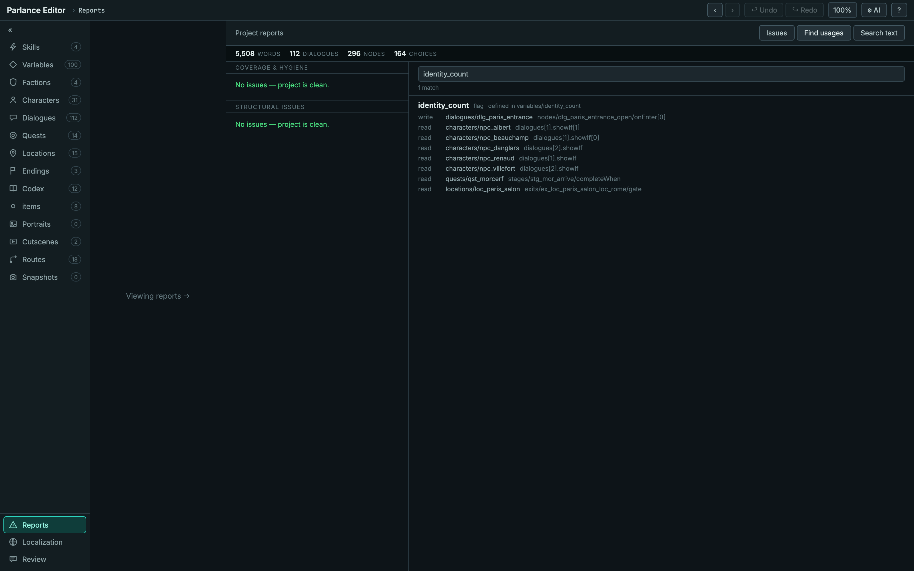
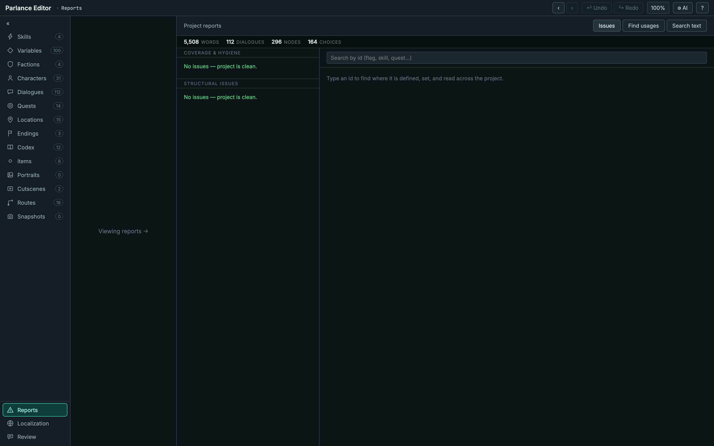

# Working at scale

Small projects hide the problem. With a dozen dialogues you can hold the whole
story in your head: you know which scene sets `knows_poison`, you know nothing
is orphaned, and renaming a flag is a two-minute grep.

At a hundred dialogues none of that is true. This page shows the views that
exist for that moment, on a real project —
[parlance-monte-cristo](https://github.com/Orbitope/parlance-monte-cristo), a
public demonstration project with **112 dialogues, 296 nodes, 31 characters,
14 quests and 100 variables**, which you can clone and open yourself.

## The flow map: every scene at once

Selecting **Dialogues** without opening one shows the project-level flow map.
Each dialogue is a node; edges are the cross-scene jumps — `set_active_dialogue`
routes and `play_cutscene` chains.



What this view tells you is *shape*: which scenes hand off to another, and which
are entered only from a location or a character's ladder. Most dialogues in a
healthy project are the latter, so a sparse map is normal — what you are looking
for is the clusters, and anything stranded that should not be.

## Filtering the list

The entity search narrows by id, name, or tag. Here the same 112 dialogues are
filtered to the 32 tagged `gossip` — the count in the header reads **32/112**.



Tagging by act, by type, or by workstream is what makes a large project
navigable; the filter is how you get back to a working subset.

## One dialogue, in detail

Opening a dialogue swaps the map for its node graph, with the inspector on the
right.



Worth noticing in the inspector: **pacing statistics** (words, nodes, choices,
max and average branch, longest path, checks, gated choices, dead ends) and
**encounter pushes** — the routes that re-point a character's ladder when this
scene ends. Two here send Caderousse and La Carconte to different follow-ups.

## Quest dependencies

The quest canvas without a quest open is the dependency graph. Edges are derived
from flags: an edge exists where one quest **writes** a flag (in a stage's
`onComplete` or an outcome's `effects`) that another quest's `availableWhen`
**needs**.



This project's shape is a long spine — the homecoming, the arrest, the prison,
the escape, the treasure — that then fans out into four parallel threads.

> **A subtlety worth knowing.** Flags written by dialogue `onEnter` are invisible
> to this derivation. A fully-chained story whose quests are gated only on
> dialogue-written flags will draw **no edges at all**, even though it plays
> correctly. If your dependency graph is empty, that is usually why: have each
> quest emit a completion marker from its terminal outcome, and depend on that.

## Find usages

The **Reports** panel's find-usages index answers the question that gets
expensive with scale: where is this id actually used?



One flag, one write, eight reads — across five character ladders, a quest
stage's `completeWhen`, and a location exit's gate, each with the exact JSON
path. This is what makes renaming or retiring a variable safe.

## Coverage and structural issues

The same panel's Issues tab groups everything the validator found, by family.



The checks that matter most here are the ones that only bite at scale:
characters with no dialogue assigned, flags set but never tested, nodes
unreachable from `entry`, endings with no path leading to them, and nodes where
every choice is conditional — a player who fails all the conditions gets stuck
with nothing to click.

That last one is worth calling out, because it is invisible in every other
tool: the dialogue is reachable, its references resolve, and it validates
cleanly. Only a player arriving with the wrong flags ever finds it.

## Try it

```bash
git clone https://github.com/Orbitope/parlance-monte-cristo.git
cd <parlance>/editor
PARLANCE_ROOT=<path>/parlance-monte-cristo npm run dev
```

The project is generated from a single hand-authored build script and rebuilds
byte-identically, so you can edit it freely and always get back.
