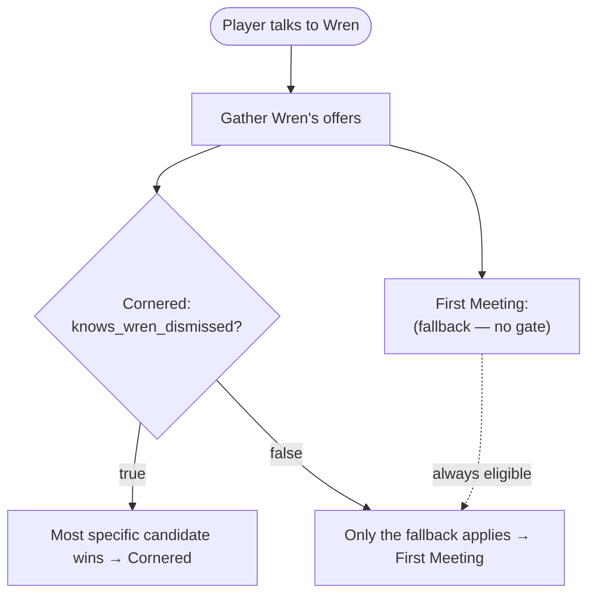

# Dialogue offers

## The problem

The player walks up to a character. *Which conversation plays?*

Not "which conversations exist" — which one plays **right now**, given
everything that has happened: what the player knows, what they carry, what
they've done. Most tools answer with scripting: `if` chains in the engine, or
availability flags scattered across the dialogues themselves. Both drift, and
neither can be checked.

Parlance's answer is the **offer**: each dialogue self-declares when it should
play, and the engine picks the best fit. There is no ordered list to maintain
and no array position that silently decides the outcome.

## The mechanism

A dialogue carries an optional `offer` object — `{ character?, when?,
priority? }`. Its presence is the opt-in: a dialogue with an offer is a
candidate for that character; one without is reached only by direct routing (a
choice's `goto`, a scene push, a world placement). Resolution is the entire
rule — this is the shape of the runtime contract:

```
resolveCharacterDialogue(state, character, project, visited?):
  candidates = every dialogue whose offer is for `character`
               and whose `when` passes (absent `when` = always)
  drop any visited, non-replayable candidate
  pick the best by: highest priority tier,
                    then most specific condition,
                    then lowest id
  (nothing left → null)
```

Consequences fall straight out:

- **Order in the file never matters.** A dialogue carries its own eligibility;
  where it sits in the project is irrelevant. "Most specific wins" is the
  engine's job, not something you hand-sort.
- **`offer.character` defaults to the dialogue's `speakerId`** — set it only
  when one character presents a scene spoken by another.
- **An offer with no `when` is a fallback** — offered whenever nothing more
  specific or higher-tier applies. Give a character one and they always have
  *something* to say.
- **`offer.priority` (default 0) is a tier.** A higher tier beats every
  lower-tier candidate, however specific — the escape hatch for "this must win
  now."
- **Nothing matched → `null`.** The character has no dialogue right now. Legal,
  but usually a mistake — see the checks below.

Re-entry needs no special code: talking to a character again just re-runs
resolution against current state, so once flags change, a different offer wins.

## A worked example

When the player talks to a character, the engine gathers every offer aimed at
them, keeps the ones whose gate passes, and picks the most specific:



Each dialogue declares its own offer — Wren's two live in the dialogue files,
not on the character:

```json
// dlg_wren_cornered.json
"offer": { "when": { "type": "flag", "flag": "knows_wren_dismissed", "value": true } }

// dlg_wren_first.json
"offer": {}
```

Talk to Wren early and only the fallback applies — you get `dlg_wren_first`, the
polite apothecary. Learn that Vane dismissed him without a character
(`knows_wren_dismissed`, set by another scene), come back, and the gated offer
is now the most specific candidate: you can corner him. Nothing scripted a
transition, and neither dialogue references the other — the engine re-picked.

<div class="dialogue-sample">
  <div class="speaker">Wren — the fallback, before you know</div>
  <p class="line">"I sell tinctures, magistrate. Nothing stronger."</p>
</div>
<div class="dialogue-sample">
  <div class="speaker">Wren — the gated offer, once you know</div>
  <p class="line">"He dismissed you without a character, Mr. Wren. In spring.
  Shall we start again?"</p>
</div>

## Patterns

**The arc, spread across its scenes.** Instead of one ordered list, each scene
states the situation it belongs to: the confrontation gates on evidence, the
mid-arc variations gate on their flags, the greeting gates on nothing. The arc
is the same, but each piece is local and can't be shadowed by a neighbour's
position in a list.

**Tiers for "this wins now."** When a scene must take precedence regardless of
how specific the others are, give its offer a higher `priority`. That is the one
place ordering is explicit — a number you set on purpose, not an accident of
array position.

**The feed model.** The effect `set_active_dialogue` doesn't write a hidden
override — it sets the flag `active_dialogue__{character}`, and the routed scene
carries a tier-1 offer gated on that flag. Scene routing is therefore visible as
an offer, in the same place as everything else.

**NPC interactables** in locations resolve through exactly the same call — a
"forced" conversation is just a high-priority, flag-gated offer.

## The mistakes the validator catches

Offers have a handful of classic failure shapes. All are
[`OFFER` checks](/docs/reference/validation-checks/) — warnings on every save,
none blocking:

1. **No fallback** — a character has offers but none is unconditional, so in
   states where every `when` fails they resolve to `null` and have nothing to
   say. Add a no-`when` offer.
2. **Prioritized fallback** — an offer carries a `priority` but no `when`: it
   wins over every lower tier forever and re-fires on every re-entry. Gate it,
   or drop the priority.
3. **Unbreakable tie** — two offers at equal priority *and* specificity that
   aren't provably exclusive: the lower id silently decides which wins. Make one
   more specific, tier it, or gate them so they can't both apply.
4. **Forced offer out-ranked** — a `set_active_dialogue` target that an ordinary
   higher-priority offer would beat while the routing flag is set, so the push
   plays the wrong scene. Raise the forced offer's tier.
5. **Routes nothing** — `set_active_dialogue` names a dialogue that carries no
   offer reading its `active_dialogue__` flag, so the push lands nowhere.
6. **Stranded speaker** — a character's dialogue that carries no offer and has
   no world placement: unreachable content.

A dangling `offer.character`, or an offer for a dialogue that doesn't exist, is
a hard error, not a warning.

## Seeing it live


<p class="shot-caption">The inspector's offer editor and resolution preview — the worked example above, as you'd author and check it.</p>

The dialogue inspector shows an offer's **status** — does its `when` pass in the
current play state? — **where it ranks** against the character's other offers,
and a **live resolution preview** that re-runs `resolveCharacterDialogue` and
highlights the winner. Flip a flag like `knows_wren_dismissed` and watch the
winner change. The preview calls the same resolution code the runtime uses, so
what you see is what ships. Try it in the
[hands-on tutorial](/docs/get-started/dialogue-ladders/).

## The guarantees

- `resolveCharacterDialogue` is **the canonical mechanism** — the only dialogue
  selection with published conformance vectors, which every engine port must
  pass.
- Editor preview, playtest, and engine runtime share the same resolution
  semantics; they cannot disagree.
- Selection is **order-independent**: the vectors pin the ranking (priority tier
  → condition specificity → lowest id), so two conformant engines resolve the
  same winner from the same state.

**Next:** [build one in ten minutes](/docs/get-started/dialogue-ladders/), or
see how offers slot into [the wider loop](/docs/concepts/workflow/).
